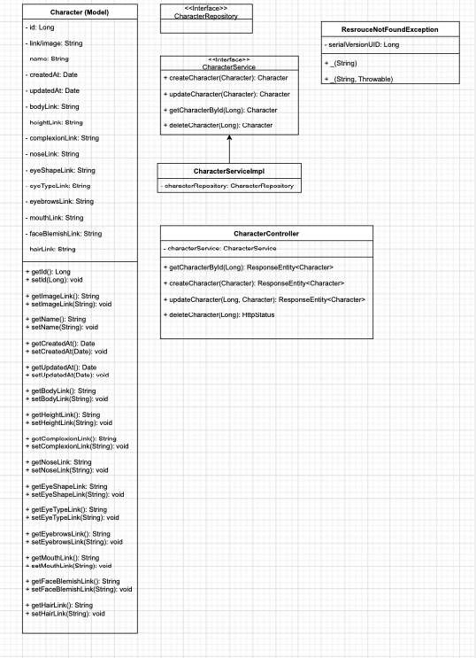

# character-generator
Build a 2D character generator with Spring and Java as the backend and React, Redux, and Javascript as the frontend. 

## Refer to UML:

# Functional/Non-Functional Requirements

## Business Requirement (BR):
BR01: This Character Generator website will allow users to build a personalized 2D character and save their character to their own device.

## Requirement Statement (RS):
RS01: The application should allow users to build a 2D character from a basic human form to a fully formed 2D avatar with features and clothes.

RS02: Users should have the ability to save their completed character to their personal device as a .png file.

RS03: When a user clicks on a category to choose from the options for that category there will be a group of images that appear with the options.

## Functional Requirement List (FR):

**F01:** Click **Start** button to begin building character

**F02:** Choose **body type** from group of options

* User will have to choose this before you can see the clothing tab/button

**F03:** Choose **height** of character using sliding bar *(5’0” - 6’5”)*

**F04:** Choose **complexion** using color wheel

**F05:** Choose **nose type** from group of options

**F06:** Choose **eye shape** from group of options

**F07:** Choose **eye type** from group of options

**F08:** Choose **eye color** using color wheel

**F09:** Choose **eyebrows** from group of options

**F10:** Choose **mouth** from group of options

**F11:** Choose **face blemish** from group of options

**F12:** Choose **hair type** from group of options

* curly, wavy, straight options

**F13:** Choose **hair style** from group of options 

* This will show you the options for the hair type the user picks

**F14:** Choose **hair color** using color wheel
 
* This includes a sliding bar for ombre effect - choose two colors from color wheel on either side of the bar and slide to create ombre

**F15:** Click on **Clothing** button/icon to see clothing options 

* User can access this after choosing a body type

**F16:** Choose **shirt** from group of options

**F17:** Choose **pants** from group of options

**F18:** Choose **dress** from group of options

**F19:** Choose **skirt** from group of options

**F20:** Choose **socks** *(optional)* from group of options

**F21:** Choose **shoes** from group of options

**F22:** Click on **Finish** button once user is done editing/creating character

**F23:** Option to download to personal device as .png file will appear in new window (choose this or F24)

**F24:** Option to share character on various apps will appear in new window (choose this or F23)

## Information Requirement List (IR):

### Key:

First Header | Second Header
------------ | -------------
Data			| D
Image			| I

**I01:** User ID (D)

**I02:** User Name (D)

**I03:** Image options (I)

* Image options from the various categories
 
**I04:** Image ID (D)

**I05:** Created Date (D)

**I06:** Color Wheel (D)

## Qualities (Q):

**Q01:** Usability

* User can easily click on the icons representing the various features for their character
* Once the User clicks on the finish button the options to share and/or download will appear which make it easy for user to perform either action

**Q02:** Trainability

* It should take the user no more than 30 minutes to understand the basic application and how to use it properly

**Q03:** Availability

* The application needs to be available during business hours but preferably outside of business hours as well. Users may decide to use this application for personal use.

**Q04:** Reliability

* The application should work properly and smoothly, and all buttons should work for user to start, finish, and share/download their finalized character

## Constraints (C):

**C01:** Individual System Technical Difficulties (i.e. loss of internet connection, lack of system authorization, etc.)
